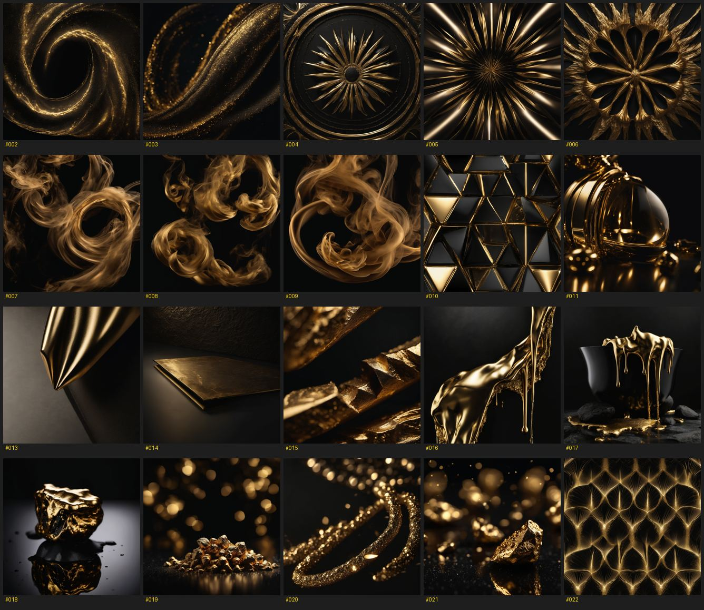
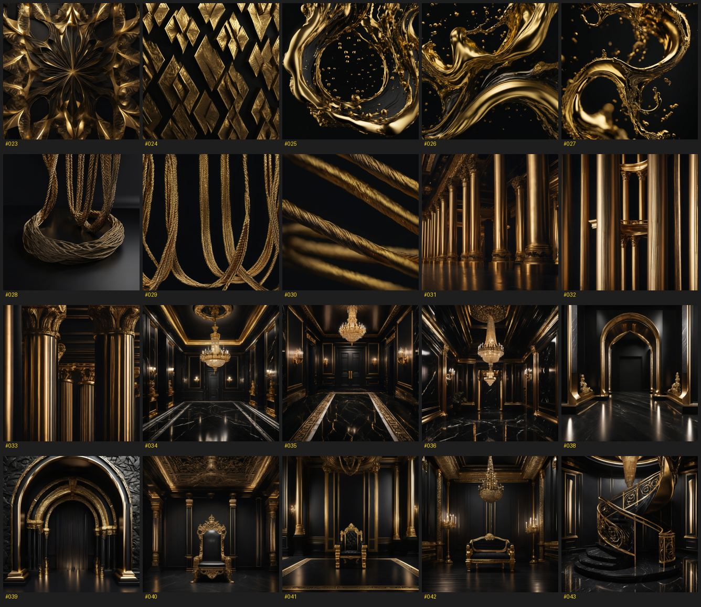
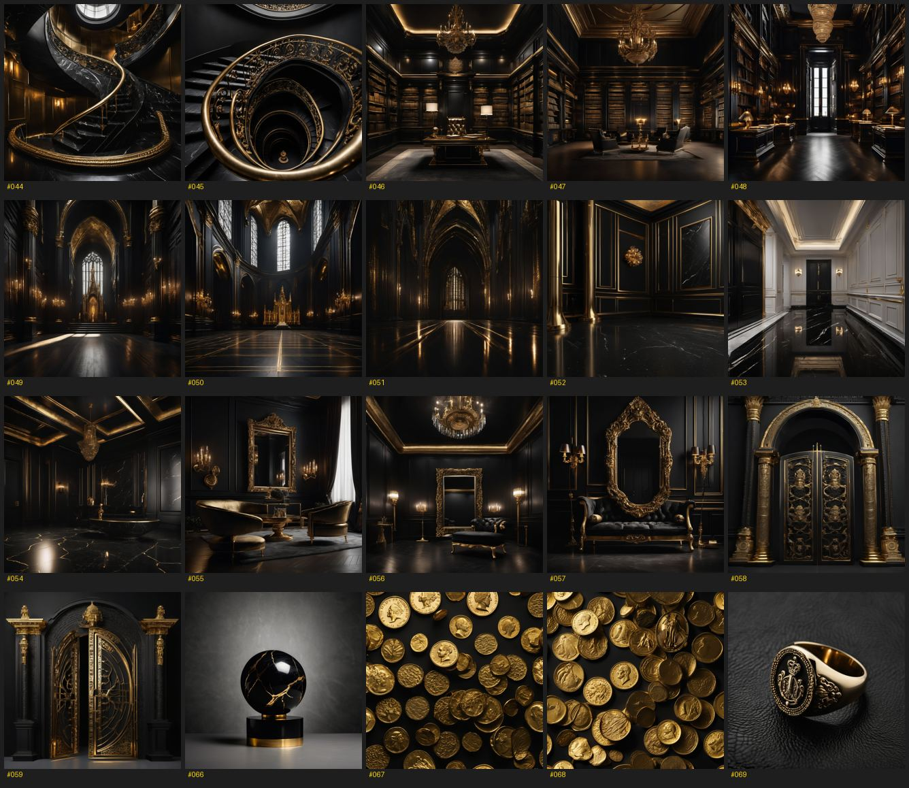
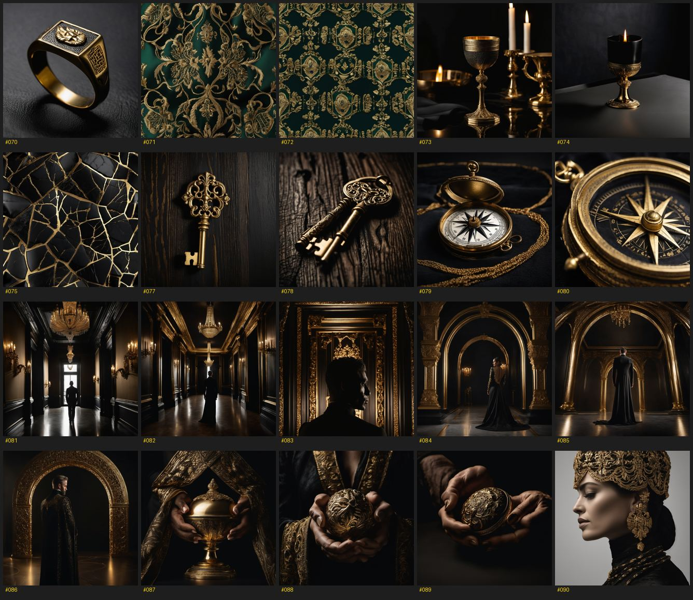
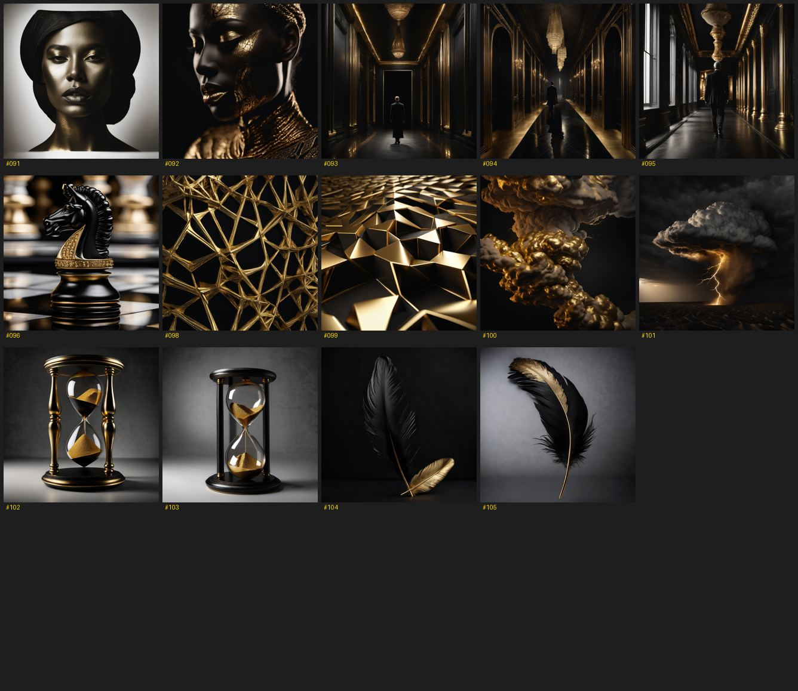

# Seed Image Curation Review

Open this PR on GitHub to see the actual images rendered inline below each contact sheet.
94 raw seed images were generated. They're grouped into 5 contact sheets (grids of thumbnails,
labeled with their `#NNN` index = `seed_NNN.png` in `image-gen/dataset/raw_seed/`).

**How to review:** Look at each sheet image below, then check the KEEP/REJECT table against what
you see. Reply in chat with any numbers you want to move between lists (e.g. "keep #013 too" or
"reject #096"), or just say "approved" to confirm the shortlist as-is.

---

## Contact Sheet 0 (#002 - #022)

## Contact Sheet 1 (#023 - #043)

## Contact Sheet 2 (#044 - #069)

## Contact Sheet 3 (#070 - #090)

## Contact Sheet 4 (#091 - #105)

---

## Proposed KEEP list (68 images)

| Group | Numbers |
|---|---|
| Abstract gold textures/liquid/smoke | 002, 003, 004, 005, 006, 007, 008, 009, 010, 011, 023, 025, 026, 027 |
| Geometric/pattern gold-on-black | 024, 098, 099 |
| Imperial architecture (columns, halls, arches, stairs) | 031, 032, 033, 039, 044, 045, 046, 049, 050, 051, 052, 058, 059, 093, 094, 095 |
| Throne rooms / regal interiors | 034, 035, 036, 038, 040, 041, 042, 043, 047, 048, 054, 055, 056, 057 |
| Objects (keys, compass, coins, goblets, ring) | 067, 068, 069, 070, 073, 074, 075, 077, 078, 079, 080 |
| Silhouetted robed figures (best brand-identity shots) | 081, 082, 083, 084, 085, 086, 087, 088, 089 |
| Chess/power symbolism | 096 |
| Feathers (dark+gold) | 104, 105 |
| Gold nuggets/bokeh | 018, 019, 020, 021, 022 |

## Proposed REJECT list (26 images)

| # | Reason |
|---|---|
| 013, 014, 015, 016, 017 | Grey/neutral studio background — breaks dark palette |
| 028, 029, 030 | Generic gold rope/chain, redundant with better texture shots |
| 053 | White marble hallway — breaks dark palette |
| 071, 072 | Green damask pattern — wrong color palette |
| 090 | Light/white studio background |
| 091, 092 | Portrait busts on light background (also raises stock-likeness concerns) |
| 100, 101 | Storm clouds/lightning — off-concept (weather, not imperial/luxury) |
| 102, 103 | Hourglasses on light grey studio background |

---

**Next step once approved:** write captions (trigger word `macalempire style` + description) for
each KEEP image, then run `prepare_dataset.py --input raw_seed --output curated --auto-caption`.
